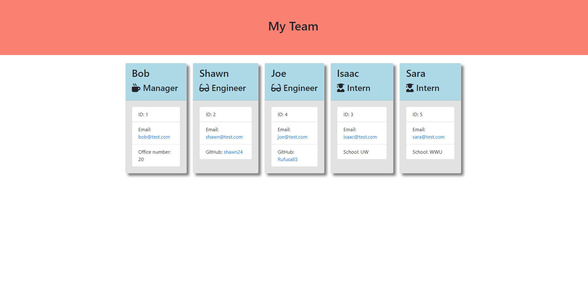

# Team Generator 

## Description

I created this application to generate an HTML page with a group of team members that will appear on cards in the main body. This application is useful if you want to organize your development team in a clean and easy way. 

## Table of Contents
- [Installation](#installation)
- [Usage](#usage)
- [License](#license)
- [Contributing](#contributing)
- [Tests](#tests)
- [Questions](#questions)
- [Credits](#credits)

## Installation

To install this team generator, the user will need to create a clone of this repository by using the command `git clone` in git bash. The user will then have to open this repository in VSCode. The user will have to have node installed on their vscode.  

[For more information on installing npm](https://docs.npmjs.com/cli/v8/commands/npm-install)  

The user will then need to open the main directory in the integrated terminal and run the command `npm i` to install the neccessary dependancies for the application to run.
Then to start the application, the user will need to run `node index.js` in the terminal.

## Usage

There is ALREADY a sample HTML file created in this repository. Please delete that file before generating a new one.

- After running `node index.js` the user will be prompted with a series of questions to fill out for the manager position. 

- Upon completion of the manager's questions, the user will see the main menu which contains a list of options, (Add new intern, addnew engineer, or quit). 

- Add engineer will prompt the user with a series of questions about the engineer. Once those questions have been answered, the user will be brought back to the main menu. 

- Add intern will prompt the user with a series of questionsabout the intern. Once those questions have been answered, the will be brought back to the main menu. 

- The quit option will terminate the program and generate an HTML file with all the information the user had answered via the prompted questions.

I have provided a link to a video of me demoing the application installation, usage, and the HTML document that is generated.  

[Link to live demo video](https://watch.screencastify.com/v/68pbWEEyR4DMWeXqqW46)

### Provided here is a screenshot of the generated HTML

## License

MIT License

Copyright &copy; 2022 Isaac Petersen

Permission is hereby granted, free of charge, to any person obtaining a copy
of this software and associated documentation files (the "Software"), to deal
in the Software without restriction, including without limitation the rights
to use, copy, modify, merge, publish, distribute, sublicense, and/or sell
copies of the Software, and to permit persons to whom the Software is
furnished to do so, subject to the following conditions:

The above copyright notice and this permission notice shall be included in all
copies or substantial portions of the Software.

THE SOFTWARE IS PROVIDED "AS IS", WITHOUT WARRANTY OF ANY KIND, EXPRESS OR
IMPLIED, INCLUDING BUT NOT LIMITED TO THE WARRANTIES OF MERCHANTABILITY,
FITNESS FOR A PARTICULAR PURPOSE AND NONINFRINGEMENT. IN NO EVENT SHALL THE
AUTHORS OR COPYRIGHT HOLDERS BE LIABLE FOR ANY CLAIM, DAMAGES OR OTHER
LIABILITY, WHETHER IN AN ACTION OF CONTRACT, TORT OR OTHERWISE, ARISING FROM,
OUT OF OR IN CONNECTION WITH THE SOFTWARE OR THE USE OR OTHER DEALINGS IN THE
SOFTWARE.

## Contributing

To contribute, please contact me via my email or through github.

## Tests

Tests ran and passed by myself. Tests were written by Joe Rehfuss.

## Questions

To contact me, use one of the links below:  
[Github profile](https://www.github.com/idpetersen)  
[Email Me](mailto:isaac.petersen5@gmail.com)

## Credits

Thank you to Sabrina Hanson for collaborating with me on this project. 